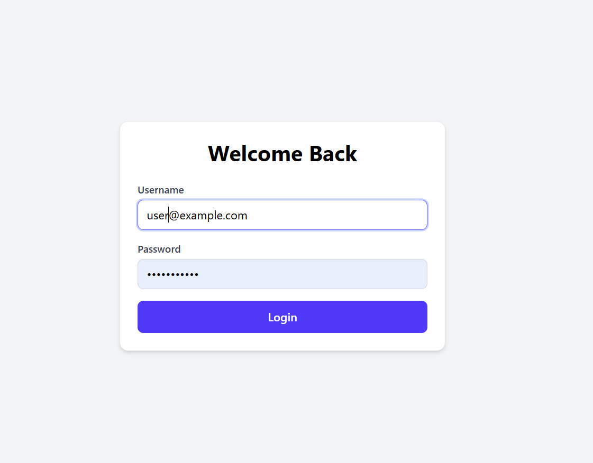
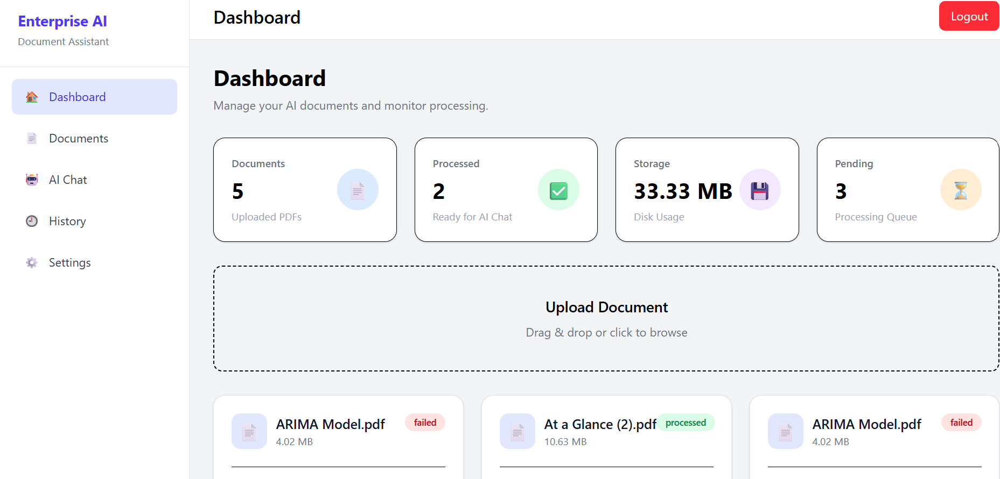

# Enterprise Document AI Assistant

> A production-ready Retrieval-Augmented Generation (RAG) application for intelligent document understanding, semantic search, and conversational question answering.


---

## Overview

Enterprise Document AI Assistant enables users to upload PDF documents and interact with them using natural language through a Retrieval-Augmented Generation (RAG) pipeline.

The application combines semantic search with Large Language Models to generate grounded answers while citing the relevant document passages.

---

## Features

- JWT Authentication
- Secure User Login & Registration
- PDF Upload & Processing
- Text Extraction using PyMuPDF
- Intelligent Text Chunking
- BAAI BGE Embeddings
- FAISS Vector Database
- Semantic Search
- Ollama Llama 3 Integration
- Source Attribution
- Multi-document Management
- Modern Dashboard
- Responsive React UI

---

# Screenshots

## Login



---

## Dashboard



---

## Chat Interface


---

## Upload Documents


---

# Architecture

```

React + TypeScript
│
▼
FastAPI REST API
│
├───────────────┐
│               │
▼               ▼
PostgreSQL JWT Authentication
│
▼
PyMuPDF
│
▼
Text Chunking
│
▼
BAAI BGE Embeddings
│
▼
FAISS Vector Store
│
▼
Ollama (Llama 3)
│
▼
Grounded AI Response
│
▼
Source Attribution


Tech Stack

| Category       | Technology             |
| -------------- | ---------------------- |
| Frontend       | React 19               |
| Language       | TypeScript             |
| Styling        | Tailwind CSS           |
| Backend        | FastAPI                |
| ORM            | SQLAlchemy             |
| Database       | PostgreSQL             |
| Authentication | JWT                    |
| Migration      | Alembic                |
| PDF Processing | PyMuPDF                |
| Embeddings     | BAAI/bge-small-en-v1.5 |
| Vector Store   | FAISS                  |
| LLM            | Ollama (Llama 3)       |
| API            | REST                   |


Project Structure

enterprise-document-ai-assistant/

├── backend/
│   ├── app/
│   ├── alembic/
│   ├── storage/
│   └── requirements.txt
│
├── frontend/
│   ├── src/
│   ├── public/
│   └── package.json
│
├── docs/
│   ├── login.png
│   ├── dashboard.png
│   ├── chat.png
│   └── upload.png
│
└── README.md


Installation

1.Backend
cd backend

python -m venv .venv

source .venv/bin/activate

pip install -r requirements.txt

uvicorn app.main:app --reload


2.Frontend
cd frontend

npm install

npm run dev


API Endpoints

| Method | Endpoint          | Description      |
| ------ | ----------------- | ---------------- |
| POST   | /auth/register    | Register User    |
| POST   | /auth/login       | Login            |
| GET    | /documents        | List Documents   |
| POST   | /documents/upload | Upload PDF       |
| POST   | /chat             | Ask Questions    |
| GET    | /documents/{id}   | Document Details |


Future Enhancements
1.Conversation History
2.Streaming Responses
3.OCR Support
4.Multi-file Chat
5.Docker Deployment
6.Cloud Storage
7.Admin Dashboard


Author
Sanchita Nannaware
IIT Kharagpur


License

This project is released under the MIT License.

---

# Step 2: Add a Project Description on GitHub

When you create or edit the GitHub repository, use this short description:

> **Production-ready RAG application for intelligent PDF understanding using FastAPI, React, PostgreSQL, FAISS, and Ollama (Llama 3).**

---

# Step 3: Add Repository Topics

On GitHub, add these topics:

```text
rag
fastapi
react
typescript
python
llm
ollama
faiss
postgresql
jwt
pdf
semantic-search
document-ai
tailwindcss
```

These make your repository easier to discover and look more polished.

---

## A few final improvements

Before you consider the project complete, I'd also suggest:

- Add a short GIF (20–30 seconds) showing the upload → chat workflow.
- Add a `LICENSE` file (MIT is a good default if you want to open-source it).
- Include a small "Known Limitations" section in the README (for example, noting that conversation history is a planned enhancement). This shows thoughtful engineering and sets clear expectations.

At this point, your project has evolved well beyond a basic CRUD app. It demonstrates authentication, document processing, vector search, RAG, a modern React frontend, and a clean backend architecture—all of which make it a strong portfolio piece for SDE and AI-focused internships.